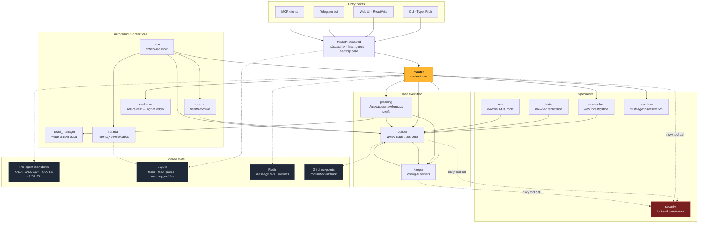

# YAPOC — Yet Another OpenClaw

An autonomous multi-agent system where a small hierarchy of LLM-driven agents collaborate over a shared file system to plan, build, and operate software. The end goal is a Master agent capable enough to finish the rest of the system itself.

Currently 11 agents (master, planning, builder, keeper, doctor, model_manager, cron, evaluator, librarian, researcher, security) cooperate through markdown files, a SQLite task queue, and a Redis message bus.

Last updated: 2026-09-02

<!-- Source: docs/architecture.mmd — edit there and mirror here. -->


Solid arrows are delegation paths (taken from each agent's
`delegation_targets` in `CONFIG.yaml`); dotted arrows are shared state and
the security gate, which screens every risky tool call regardless of who
makes it.

---

## Quick start — guided installation

The installer supports **Linux, Windows and macOS** using Node.js 22+ and Docker.
It guides you through:

1. Choosing a master folder where YAPOC can work freely.
2. Selecting an allowed AI provider and entering its API key.
3. Optionally pairing a Telegram bot with your private chat.
4. Configuring and starting YAPOC, including Redis and the built dashboard.
5. Opening the browser after readiness checks pass.

From this checkout:

```sh
node installer/index.mjs --source .
```

Or, with Node.js and Git installed, use the preview branch directly:

```sh
npx --yes --package=github:kuweg/yapoc#feat/guided-installer yapoc-install --ref feat/guided-installer
```

Python, Poetry and frontend build dependencies run inside the container. The
host needs Docker running; setup explains how to retry if it is missing.
The first build includes the ML dependencies and can download several gigabytes.

See the **[installation guide](docs/installation.md)** for Linux/macOS `curl`,
Windows PowerShell, prerequisites, folder permissions, Telegram pairing,
start/stop commands, troubleshooting and validation limits. The npm registry
package has not been published; use the checkout or GitHub command above.

### Developer setup

The existing native Poetry workflow remains available for source development.
The older `scripts/install.sh` is the Linux/macOS developer bootstrap; it is
separate from the cross-platform guided installer.

### Manual install

1. **Install dependencies** (Poetry resolves and installs the Python environment).

   ```bash
   poetry install
   ```

2. **Run the interactive setup wizard** to pick a provider, validate your key,
   write `.env`, and rewrite `agent-settings.json`.

   ```bash
   poetry run yapoc init
   ```

   *Expected outcome:* `.env` written and `agent-settings.json` rewritten.

3. **Run the preflight check** to confirm the environment is ready.

   ```bash
   poetry run yapoc doctor
   ```

4. **Start the backend daemon.**

   ```bash
   poetry run yapoc start   # backend daemon
   ```

5. **Launch the interactive REPL** — or open the web UI.

   ```bash
   poetry run yapoc         # interactive REPL — or open http://localhost:5173
   ```

The CLI REPL supports tab-completion, `@file` mentions, `!bash` mode, `/diff`, `/copy`, `/export`, and live cost tracking. Run `/help` inside the REPL to see the full set.

---

## Architecture

```
User
 └─ CLI (Typer/Rich) ─────┐
 └─ Web UI (React/Vite) ──┤── FastAPI backend ── Master agent
 └─ Telegram bot ─────────┘                       │
                                                  ├── Planning   (decomposes complex tasks)
                                                  ├── Builder    (code edits, shell)
                                                  ├── Keeper     (config, .env, settings)
                                                  ├── Researcher (web + investigation)
                                                  ├── Evaluator  (review, quality gate)
                                                  ├── Librarian  (memory consolidation)
                                                  ├── Doctor     (cron: health monitor)
                                                  ├── Model Mgr  (cron: model availability)
                                                  ├── Cron       (scheduled tasks)
                                                  └── Security   (tool-call gatekeeper, LLM L2)
```

Each agent lives in `app/agents/<name>/` and owns a small set of markdown files:

| File | Role |
|------|------|
| `PROMPT.MD` | System prompt — agent identity (committed) |
| `CONFIG.yaml` | adapter, model, tools, sandbox (committed) |
| `TASK.MD` | Current task + frontmatter status (runtime) |
| `MEMORY.MD` | Append-only run log (runtime) |
| `NOTES.MD` | Persistent knowledge (runtime) |
| `HEALTH.MD` | Error log written by self / doctor (runtime) |
| `LEARNINGS.MD` | Auto-injected lessons (runtime) |
| `STATUS.json` | Live runner state (runtime) |

Runtime files are gitignored — only the code-like files (`PROMPT.MD`, `CONFIG.yaml`, `agent.py`) are committed.

Config resolution: `app/config/agent-settings.json` → `CONFIG.yaml` → `app/config/settings.py` defaults.

---

## Key concepts

**Centralized settings.** Every config value lives in `app/config/settings.py` (pydantic-settings). Application code reads from `from app.config import settings`; nothing reads `os.environ` directly.

**Security gate.** Risky tool calls (`file_delete`, `shell_exec`, `kill_agent`, etc.) go through a two-layer gate before execution: a synchronous hardcoded ruleset (`app/utils/tools/security_policy.py`) for absolute denies/allows, and an LLM classifier (the `security` agent) for the ambiguous middle. Edits to critical config files are *not* blocked — only deletions are. Every decision is logged to `app/agents/security/AUDIT.MD`.

**Sessions.** Browser tabs and CLI shells each get a session id. `/api/task/stream` and the WebSocket relay are session-scoped so multiple users / shells don't crosstalk.

**Cost governance.** Per-task, per-agent, and daily-autonomous budgets are configurable in `.env` (defaults: $2 / $0 / $10). Streaming turns abort at the cap and write a clear `[BUDGET EXCEEDED]` message to `HEALTH.MD`.

**Git autocheckpoint.** Each sub-agent task spawn snapshots HEAD, runs a smoke check on terminal status, and commits or rolls back. Lets the system self-modify without bricking.

**Stuck-loop detection.** The streaming layer watches for 3+ consecutive copies of a short substring in the model output and aborts the turn cleanly — small models occasionally fall into "Let me check X:Let me check X:..." spirals.

---

## CLI

```
yapoc start | stop | restart   # backend lifecycle
yapoc status | ping            # backend health
yapoc                          # interactive REPL
yapoc chat "hello"             # one-shot message
yapoc agents list | status     # agent inventory
yapoc models list | info       # LLM model picker
yapoc report                   # write the morning report manually
yapoc evaluator-tick           # kick the evaluator once
```

---

## Frontend

`app/frontend/` is a Vite + React app served on port 5173 in dev mode. Vite proxies `/api/*` and `/ws` to the backend on port 8000. Key features:
- Real-time streaming of master + sub-agent activity
- Session list with rename, export, and morning-report view
- Voice mode (TTS + STT via OpenAI or local engines)
- Memory tab with hybrid (FTS5 + embedding) search
- [Notes workspace](docs/notes.md) with Markdown editing, wikilinks, backlinks, a links graph, and per-conversation note context
- [Shared model pricing](docs/model-pricing.md) with verified provider rates, source dates, and chat cost estimates
- Cost tracker per session

---

## Configuration

Copy `.env.example` to `.env` and fill in the keys you actually need. With zero keys the system still boots — you just can't reach a cloud LLM.

Provider keys it knows about: Anthropic, OpenAI, Google Gemini, DeepSeek, OpenRouter, LM Studio (local), Ollama (local).

Per-agent model bindings live in `app/config/agent-settings.json`. Edit there to swap a single agent's model without touching `.env`.

---

## Project rules

- **Poetry only.** Never `pip install`. Always `poetry add` / `poetry install` / `poetry remove`.
- **Centralized settings.** Never `os.environ.get(...)`; import `settings`.
- **Docs in `docs/` are authoritative** — when behavior contradicts documentation, the docs are right and the code needs a fix.
- **Tests run in CI.** `poetry run pytest tests/ app/backend/tests/` — 255 tests,
  expected fully green. `.github/workflows/tests.yml` runs them plus a frontend
  typecheck and build on every push. This rule used to read "no tests yet";
  that was wrong for a long time — 27 test files existed while nothing ran
  them, and 32 were failing unnoticed.

See `CLAUDE.md` for the working agreement used when running Claude Code in this repo, and `app/agents/*/CLAUDE.md` for per-subsystem briefings.

---

## Layout

```
app/
├── config/        # settings.py (single source of truth)
├── agents/        # one dir per agent
│   ├── base/      # BaseAgent + AgentRunner subprocess machinery
│   ├── master/    # Entry point
│   ├── planning/  # Task decomposer
│   ├── builder/   # File / code edits
│   ├── keeper/    # Config manager
│   ├── doctor/    # Health monitor (cron)
│   ├── model_manager/
│   ├── evaluator/
│   ├── librarian/
│   ├── researcher/
│   ├── cron/
│   └── security/  # Tool-call gatekeeper
├── backend/       # FastAPI app, routers, dispatcher, message bus
├── cli/           # Typer + Rich REPL
├── utils/
│   ├── adapters/  # LLM adapter registry (8 providers)
│   ├── tools/     # 40-tool registry agents can invoke
│   └── db.py      # SQLite task_queue + memory index
└── frontend/      # React/Vite dashboard
```

<!-- Keep this table in sync with app/agents/ and app/config/agent-settings.json when agents change. -->
## Agents

| Agent Name | Purpose | Key Capabilities / Typical Use Case |
|------------|---------|--------------------------------------|
| master | System entry point | Orchestrates the hierarchy, delegates tasks |
| planning | Task decomposer | Breaks complex tasks into manageable sub-tasks |
| builder | Code/file editor | File and code edits over the shared file system |
| keeper | Config manager | Config, `.env`, and settings management |
| model_manager | Model availability (cron) | Monitors and manages LLM model availability |
| cron | Scheduled tasks | Runs scheduled/recurring tasks |
| evaluator | Quality gate | Reviews work and serves as a quality gate |
| doctor | Health monitor (cron) | Monitors agent/system health |
| librarian | Memory consolidation | Consolidates memory |
| researcher | Web + investigation | Web search and investigation |
| security | Tool-call gatekeeper | LLM gatekeeper in the two-layer security gate |

---

## Status

Implemented: all 11 agents, FastAPI backend, Typer CLI + Rich REPL, React frontend, 8 LLM adapters with cross-provider failover, 40-tool registry, watchdog-based runner, SQLite + Redis IPC, session persistence, context auto-compaction, cost tracking + budgets, security gate, git autocheckpoint, stuck-loop detector, voice (TTS/STT), Telegram bot, webhook ingest.

Not implemented: persistent Telegram auth across restarts, formal test suite, dark-mode UI, multi-user RBAC.
